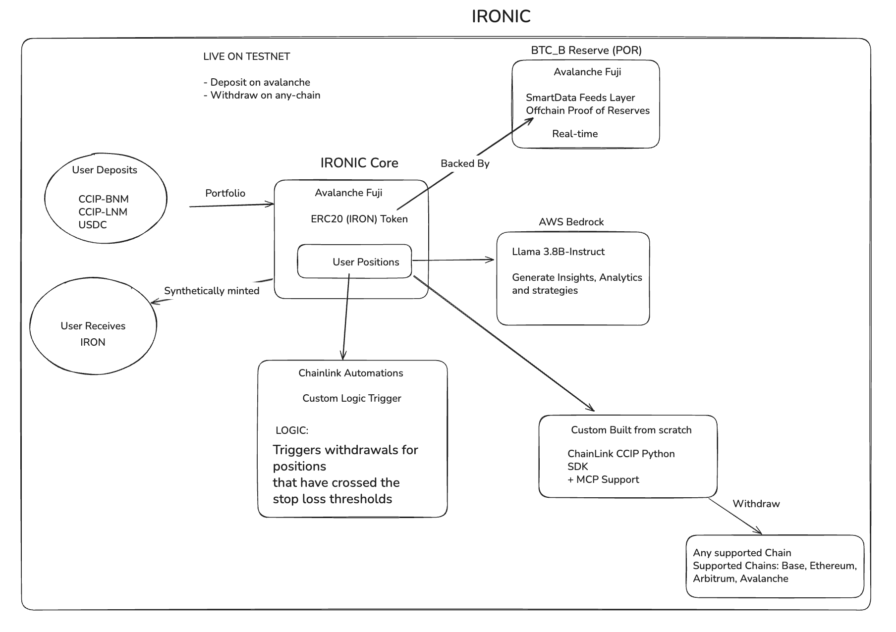

# IRONIC Protocol

> Cross-chain synthetic assets backed by real-world reserves with AI-powered portfolio management and automated risk controls

 

## 🌟 Overview

A DeFi protocol that enables users to mint  synthetic assets on avalanche-fuji backed by real-world reserves. Built on Avalanche Fuji with cross-chain compatibility, the protocol leverages Chainlink's infrastructure for price feeds, automation, and cross-chain communication.

### Key Features

- **Cross-Chain Synthetic Assets**: Mint IRON tokens backed by real-world reserves and withdraw using ccip-sdk in python to any chain of your choice
- **AI-Powered Insights**: LLaMA 3.7b integration for portfolio analytics
- **Automated Risk Management**: Chainlink Automation for stop-loss triggers and Risk Management Network
- **Real-Time Price Feeds**: Chainlink SmartData feeds integration
- **Custom CCIP SDK**: Seamless cross-chain transfers

## Development Setup

### Installation

1. **Clone the repository**
```bash
git clone https://github.com/dhananjaypai08/Ironic
cd Ironic
git submodule update --init --recursive # Install ccip-sdk submodule
```

2. **Install dependencies**
```bash
cd frontend
npm install --legacy-peer-deps

# Python SDK
cd ccip-transfer-example
python3 -m venv env
pip install -r requirements.txt
```

3. **Environment Setup**
```bash
cp .env.example .env
# Fill in your configuration in frontend/ and in ccip-transfer-example/
```

4. **Running the server**
```bash
# frontend, make sure to stay in root folder
cd frontend && npm run dev
```

4. **Trying CCIP SDK**
```bash
# frontend, make sure to stay in root folder
cd ccip-transfer-example && python avalanche-base.py
```

### Risk Management

- Chainlink price feed validation
- Chainlink Automations
- Chainlink Risk Management Network

## 🌐 Live Deployments

### Testnet

| Network | Contract Address | Explorer |
|---------|------------------|----------|
| Avalanche Fuji | `0x63a65f1Aa3B73F126A01936Dc4B4814E24B93555` | [View](https://testnet.snowtrace.io/address/0x63a65f1Aa3B73F126A01936Dc4B4814E24B93555)

### Mainnet (Coming Soon) for Global Proof of Reserve Backed IRON

- Avalanche C-Chain
- Ethereum Mainnet
- Base
- Arbitrum One

## 🤝 Contributing

We welcome contributions! Please see our [Contributing Guide](CONTRIBUTING.md) for details.

## 🔗 Links

- [Website](https://ironic-c2rc.vercel.app/)